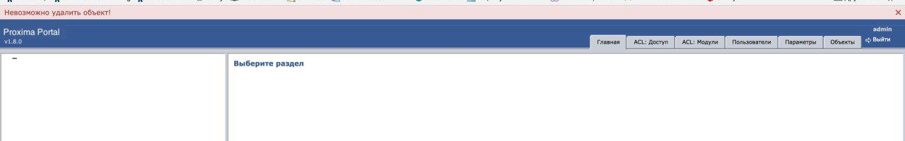

# Сессии

## Уведомления

Очень часто бывает нужно отобразить какое-либо информативное сообщение. К примеру:

 * Отменить редактирование объекта, если были введены неправильные данные
 * Запретить удаление объекта исходя из какой-то логики

В обоих случаях, пользователю нужно сообщить причину отмены его действий.

Рассмотрим вторую задачу. Допустим, есть дататип `Группа` и `Параметр`.
Последний позволяет выбрать из списка несколько групп.
Если группа, к которой "привязан" параметр, будет удалена, то в списке у параметра будет не существующее значение.

Обычно задача решается триггером:

```php
<?php

/**
 * Class PXTriggerParams
 */
class PXTriggerDatabaseParams extends PXAbstractDatabaseTrigger {
	
	/**
	 * Returns true whether given object id
	 * is referenced and false otherwise.
	 *
	 * @param int $objectId
	 * @return boolean
	 */
	protected function isReferenced($objectId) {
		return true;
	}
	
	/**
	 * {@inheritdoc}
	 */
	public function onBeforeDeleteObject(&$db, &$objId, &$format, &$objectInDB) {
		if ($format->id !== 'param_group') {
			return true;
		}
		
		return !$this->isReferenced($objId);
	}
	
}
```

Тут все хорошо, за исключением того, что пользователь не поймет, почему удаление не произошло.
Чтобы уведомить его, нужно использовать сессии и `flash messages`:

```php
<?php

$session = PXRegistry::getSession();
$session->getFlashBag()->add('warn', 'Объект не может быть удален, потому что я так вижу');
```

Отображаться сообщение будет примерно в таком формате:



Подробнее про `flash messages` можно почитать [тут](https://symfony.com/doc/current/components/http_foundation/sessions.html#flash-messages).

### Кастомизация стилей

По умолчанию, стили предусмотрены под следующие типы сообщение: `warn`, `error`, `info` и `success`.
На контейнер вешается стиль `flash` и дополнительный, в зависимости от типа - `flash_warn` и т.п.
Стили можно переопределить в локальном проекте.
